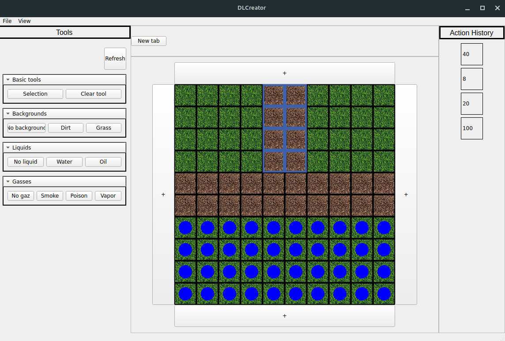
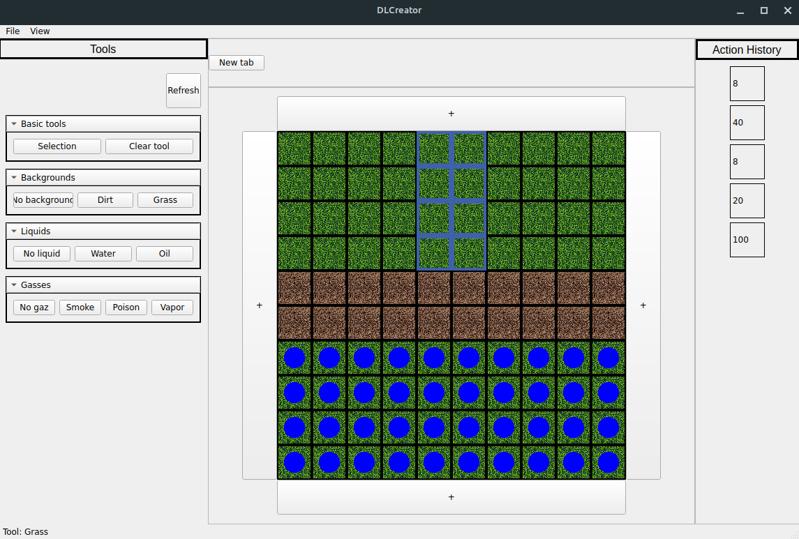
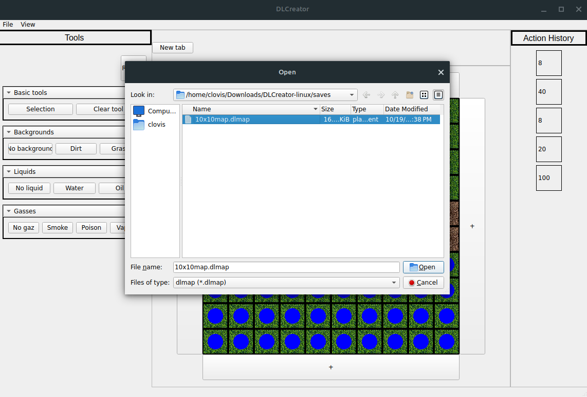
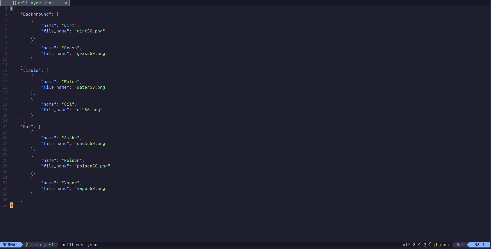
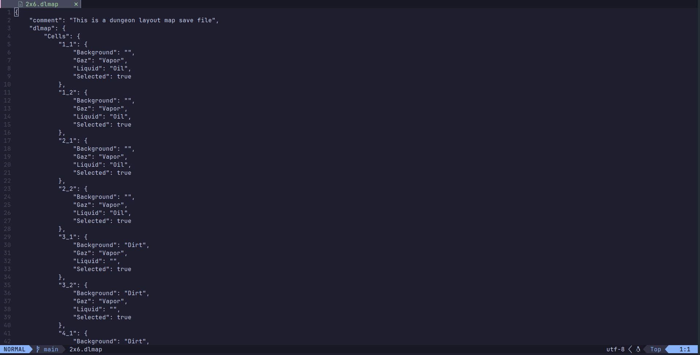

# Table of contents

- [About](#about)
- [Features](#features)
- [Screenshots](#screenshots)
- [Installation](#installation)
- [Development](#development)

# About

**DLCreator** - crossplatform tool for creating maps for D&D.

> [!NOTE]
> The project is in the development stage and not all functions have been implemented yet.

# Features

- **Create** maps with any sizes.
- **Import** any of your custom assets with ease through _JSON_.
- **Save** your maps as `.dlmap` file to edit it later.
- **Load** your maps from `.dlmap` file.
- **Export** your maps as an _image_. `[NOT YET IMPLEMENTED]`
- Ability to **manually edit** `.dlmap` files without GUI.
- Use **History** to track and undo your changes to a map. `[PARTIALLY IMPLEMENTED]`

# Screenshots

## **DLCreator GUI**





## **JSON resource file**



## **`dlmap` file**



# Installation

1. Go to [releases](https://github.com/Clovis1444/DLCreator/releases) and chose version.
2. Download `.zip` arhive for your OS from the `Assets` section.
3. Unzip **archive** content into any dir.
4. You can run **DLCreator** from the binary named `DLCreator`/`DLCreator.exe`, located _in the unzipped dir_.

# Development

```sh
git clone --depth 1 https://github.com/Clovis1444/DLCreator
```

```sh
cd ./DLCreator
```

## Build

```sh
./build.sh [args]
```

Args:

- `--release` - release build(program will be build in debug mode without this argument)
- `--run` - run program after build

> [!TIP]
> Build release and run: `./build.sh --release --run`

## Tests

```sh
./runTests.sh [args]
```

Args:

- `--release` - release build(program will be build in debug mode without this argument)
